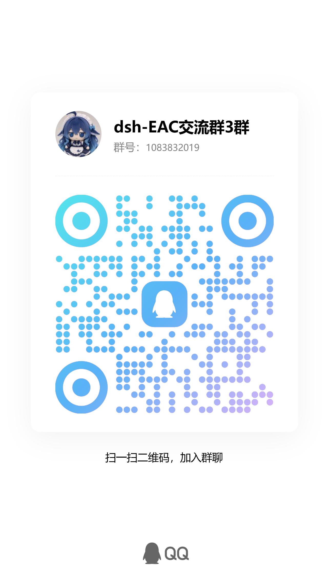

<div align="center">

<p><a href="README.md">中文</a> | <a href="README.en.md">English</a></p>

<h1>Deepseek Harness EAC — 揽尽万象</h1>

<p><strong>EAC = Embracing All Creation（揽尽万象）</strong></p>

<p>
<a href="https://github.com/zouyuxuan122/Deepseek-Harness-EAC"></a>
<a href="https://github.com/zouyuxuan122/Deepseek-Harness-EAC/releases"></a>
<a href="https://github.com/zouyuxuan122/Deepseek-Harness-EAC"></a>
<a href="https://github.com/zouyuxuan122/Deepseek-Harness-EAC/blob/main/LICENSE"></a>
</p>

<p>把官方 <a href="https://github.com/deepseek-ai/deepseek-harness">deepseek-ai/deepseek-harness</a>（<code>@deepseek-ai/dsh</code>，一切皆插件的 agent harness）
封装为<strong>开箱即用的 Windows 桌面客户端</strong>，并在其上拥抱社区万象：皮肤、插件、工具、记忆——你所能想到的，一键皆可装。</p>

<p><a href="docs/screenshot-preview.jpg"></a></p>

</div>

---

## 目录

- [为什么选择 EAC](#为什么选择-eac)
- [快速开始（安装）](#快速开始)
- [功能一览](#功能一览)
- [社区与支持](#社区与支持)
- [开发者文档](#开发者文档)
- [致谢](#致谢)
- [Star 趋势](#star-趋势)
- [许可证](#许可证)

---

## 为什么选择 EAC

| 维度 | 官方 DeepSeek Harness 默认体验 | Deepseek Harness EAC 增强 |
| --- | --- | --- |
| 安装与启动 | 需自行准备 Node.js，并通过 CLI 启动 | 内置 Node.js、npm CLI 和 dsh，提供安装版与便携版，双击即用 |
| 桌面体验 | 主要在终端或浏览器中使用 | 原生桌面窗口、系统托盘、快捷方式维护、进程清理和任务通知 |
| CLI 共存 | CLI 与 Web 通常使用同一插件环境 | 桌面端使用独立 `web-desktop` profile，与 CLI 共享会话和 API Key，插件互不干扰 |
| 插件可靠性 | 主要通过包管理器安装并手动排查问题 | 安装和启动前自动快照，异常时支持体检、修复、重试、回滚和事故报告 |
| 界面定制 | 默认使用官方界面 | 内置 10 款皮肤，支持字体、字号、颜色和移动端布局调整 |
| 项目工具 | 依赖外部编辑器和终端 | 内置文件树、行级 diff、一键还原、持久终端及 HTML/本地端口预览 |
| 上下文与人设 | 手动执行 `/compact`、编辑人设文件 | 自动压缩、人设卡管理和 `soul.md` 热重载 |
| 模型与 MCP | 主要通过配置文件或 CLI 管理 | 可视化配置视觉模型和 MCP，并支持从 Claude Code、Codex 导入配置 |
| 插件生态 | 通过 CLI 或包管理器安装插件 | 内置插件市场，可搜索并一键安装、卸载和管理插件 |
| 会话效率 | 以常规会话流程为主 | 支持临时对话、对话节点导航和第三方模型思考强度调整 |
| 消息接入 | 默认不包含 EAC 消息桥接 | 支持一键接入微信 ClawBot / OpenClaw |
| 更新维护 | 通过包管理器或手动方式更新 | dsh agent 与桌面客户端分别自动检查更新，失败时保留或回退原版本 |

> EAC 不修改官方 dsh 内核，完整保留插件架构和官方能力；默认共享
> `DSH_HOME` 中的会话与 API Key，同时隔离桌面端插件环境。

---

## 快速开始

### 系统要求

- Windows 10/11（x64）
- macOS 13+（Apple Silicon / arm64，桌面版）
- 无需预装 Node.js 或任何其他运行时

### Windows

> 正式版当前为 v4.4.1（Electron 壳）；下方 Lite 版为 Tauri（Rust）壳，体积更小、启动更快。安装包直接从 Release 下载。

| 文件 | 说明 | 大小 |
| --- | --- | --- |
| [安装版 Setup](https://github.com/zouyuxuan122/Deepseek-Harness-EAC/releases/download/v4.4.1/Deepseek-Harness-EAC-Setup-v4.4.1-x64.exe) | 安装到系统，创建快捷方式 | ~246 MB |
| [便携版 exe](https://github.com/zouyuxuan122/Deepseek-Harness-EAC/releases/download/v4.4.1/Deepseek-Harness-EAC-Portable-v4.4.1-x64.exe) | 免安装单文件，可放任意目录运行 | ~212 MB |
| [Lite 版 Setup](https://github.com/zouyuxuan122/Deepseek-Harness-EAC/releases/download/v4.5-lite/Deepseek.Harness.EAC.v4Lite_4.5.0_x64-setup.exe) | **Lite 精简版**（Tauri 壳，与上方正式版相互独立、可并存）：主程序为 `Deepseek Harness EAC v4Lite.exe`，数据目录 `~/.dsh-v4lite`，SHA256 校验文件随 Release 提供 | ~73 MB |

更多版本见 [Releases 页面](https://github.com/zouyuxuan122/Deepseek-Harness-EAC/releases)。

> 💡 **升级说明（老用户必读）**：
> - 直接下载上方最新安装包覆盖安装即可；
> - 插件、皮肤、会话与配置全部保留——数据在 `%APPDATA%\Deepseek Harness EAC\`
>   与 `~/.dsh`，升级过程不触碰。

### macOS（Apple Silicon / arm64）

> macOS 桌面版与 Windows/Linux 同源同版本，随 [v5.1.0 Release](https://github.com/zouyuxuan122/Deepseek-Harness-EAC/releases/tag/v5.1.0) 一同发布。

| 文件 | 说明 | 大小 |
| --- | --- | --- |
| [安装镜像 .dmg](https://github.com/zouyuxuan122/Deepseek-Harness-EAC/releases/download/v5.1.0/Deepseek.Harness.EAC_5.1.0_macos-arm64.dmg) | 双击挂载后拖入 Applications | ~136 MB |
| [应用包 .app.zip](https://github.com/zouyuxuan122/Deepseek-Harness-EAC/releases/download/v5.1.0/Deepseek.Harness.EAC_5.1.0_macos-arm64.app.zip) | 解压后直接运行 | ~157 MB |
| [校验和 SHA256SUMS-macos.txt](https://github.com/zouyuxuan122/Deepseek-Harness-EAC/releases/download/v5.1.0/SHA256SUMS-macos.txt) | macOS 资产 SHA256 | — |

- 桌面配置目录：`~/Library/Application Support/deepseek-harness-eac/`；dsh 数据仍在 `~/.dsh`（与 CLI 共享，会话互通）。
- 未签名、未公证（个人自用定位）：首次打开若被 Gatekeeper 拦截，右键 →「打开」。
- 客户端自更新在 macOS v1 暂不提供（上游 Release 暂无 macOS 资产）；dsh agent（内核）更新完整保留。

### Linux（x64）

> Linux 桌面端由 CI（Ubuntu 22.04）持续构建与验证，以独立版本线发布（最近维护版 v4.4.0）。Windows/macOS 走统一版本线（当前 v5.1.0），Linux 并入统一版本线待发布管线就绪后补发。

| 文件 | 说明 |
| --- | --- |
| [.deb（Debian/Ubuntu）](https://github.com/zouyuxuan122/Deepseek-Harness-EAC/releases/download/v4.4.0-linux/Deepseek-Harness-EAC-4.4.0-amd64.deb) | 安装后可从应用菜单启动 |
| [AppImage](https://github.com/zouyuxuan122/Deepseek-Harness-EAC/releases/download/v4.4.0-linux/Deepseek-Harness-EAC-4.4.0-x86_64.AppImage) | 免安装：`chmod +x` 后直接运行 |
| [.rpm（Fedora/openSUSE）](https://github.com/zouyuxuan122/Deepseek-Harness-EAC/releases/download/v4.4.0-linux/Deepseek-Harness-EAC-4.4.0.x86_64.rpm) | — |
| [.pacman（Arch）](https://github.com/zouyuxuan122/Deepseek-Harness-EAC/releases/download/v4.4.0-linux/Deepseek-Harness-EAC-4.4.0-x64.pacman) | — |

- 依赖：Tauri 2 + webkit2gtk-4.1（debian 系安装 `libwebkit2gtk-4.1-dev` 等构建依赖见仓库 CI）；AppImage 自带运行时，构建基线 Ubuntu 22.04。
- 桌面配置目录：`~/.config/deepseek-harness-eac`（XDG）；dsh 数据仍在 `~/.dsh`（与 CLI 共享）。
- 剪贴板等系统集成依赖桌面环境的 `wl-copy`/`xclip`/`xsel`，通知依赖 `notify-send`；缺失时对应能力自动降级为「外部依赖」，不伪装成功。

### 首次使用

1. 双击运行，显示启动动画，随后自动加载 DeepSeek Harness Web UI（原生窗口，仅本机回环访问）。
2. 如尚未配置 API Key，在界面「设置」内完成配置即可开始使用（与命令行 dsh 完全一致）。
3. 常用入口：设置 → 皮肤（10 款内置皮肤切换）/ 插件市场 / 模型一键选择；对话区 → 终端 / 文件标签页。

### 数据目录

> 桌面端配置在 `%APPDATA%\Deepseek Harness EAC\`（设置/更新缓存），dsh 数据
> 在 `~/.dsh`（`DSH_HOME`，会话与 API Key 与 CLI 共享）。安装版与便携版一致。
> 想强制指定 DSH 配置目录？启动前设置环境变量 `DSH_HOME` 即可（与 dsh CLI 行为一致）。

### 升级方式

- **客户端本体**：启动后自动检查上游新版本（GitHub Releases 双源回退），经你同意后下载安装；
  便携版下载整包后自动「目录树交换」并重启，安装版引导新 Setup 静默覆盖。
  失败自动保留当前版本。
- **官方 agent（dsh）**：自动检测 `@deepseek-ai/dsh` 新版本，同意后安装到数据目录 overlay，原子切换，新版启动失败可一键回退内置版本。
- 也可直接下载上方最新安装包覆盖安装，数据不会丢失。

---

## 功能一览

### 开箱即用与桌面体验

- **内置运行环境**：完整打包 Node.js、npm CLI、`@deepseek-ai/dsh` 及官方插件，无需额外安装运行时。
- **安装版与便携版**：双击启动并自动选择可用端口；便携版数据跟随程序目录，可直接迁移。
- **桌面集成**：提供原生窗口、系统托盘、快捷方式维护、进程清理和任务完成通知。
- **CLI 共存**：共享 `DSH_HOME` 中的会话与 API Key，桌面端使用独立 `web-desktop` profile，插件互不干扰。
- **自动更新**：分别更新 dsh agent 与桌面客户端，安装失败时保留或回退原版本。

### 开发工作流

- **文件树与预览**：浏览项目文件，并在应用内预览 HTML 和本地端口服务。
- **改动追踪与还原**：查看会话产生的文件变更和行级 diff，支持逐个或全部还原。
- **会话内终端**：在项目目录中使用持久 PowerShell，支持流式输出、命令历史和断线重连。
- **对话导航**：快速跳转到各条用户消息。
- **临时对话**：在独立悬浮窗中基于当前上下文追问，不污染主会话。

### 对话与模型

- **自动压缩**：上下文接近上限时自动执行 `/compact`，阈值可调，失败静默重试。
- **人设管理**：内置 6 张人设卡，支持保存、应用、删除、实时编辑和 `soul.md` 热重载。
- **图片理解**：通过 `picturereader` 分析本地或在线图片，并将结果直接带回对话。
- **MCP 与快速配置**：可视化管理 MCP，并可从 Claude Code、Codex 迁移 skills、MCP 和记忆。
- **第三方模型控制**：支持调整第三方模型的思考强度。
- **DeepSeek 余额**：显示本轮费用和账户余额，支持跳转充值及自动刷新。

### 插件与可靠性

- **统一插件市场**：通过 `dsh-unified-market` 聚合多个插件源，支持搜索、一键安装和卸载。
- **插件保护中心**：由 `dsh-plugin-shield` 配合内置 `plugin-guard` 引擎提供快照、体检、修复、重试、回滚和事故报告。
- **稳定性自愈**：自动处理 profile 模块遮蔽、插件启动异常和服务重启文件锁问题。
- **完整依赖分发**：内置插件及其自包含依赖随安装包分发，减少环境差异造成的故障。

### 界面与集成

- **界面定制**：内置 10 款社区皮肤，支持互斥切换、恢复原生外观以及字体、字号和颜色设置。
- **移动端适配**：优化窄屏下的设置面板、弹窗、侧栏和会话布局。
- **微信 ClawBot**：通过内置桥接插件一键接入微信 ClawBot / OpenClaw。

---

## 社区与支持

### 交流群

<table>
  <tr>
    <td align="center" width="50%">
      
    </td>
    <td align="center" width="50%">
      
    </td>
  </tr>
  <tr>
    <td align="center"><strong>QQ 交流群 3</strong><br />群号：1083832019</td>
    <td align="center"><strong>微信交流群</strong></td>
  </tr>
</table>

### Bug 与功能反馈

遇到 Bug，或有希望我们增加的功能，请前往 [https://eac.dtyg123.dpdns.org/](https://eac.dtyg123.dpdns.org/)。

---

## 开发者文档

完整的当前分支开发参考见 [docs/DEVELOPMENT.md](docs/DEVELOPMENT.md)，包括 Tauri 三层架构、L2 模块边界、开发/测试/打包命令、运行时数据目录、桥接契约和排障清单。

### 从源码构建（Tauri 壳，v5.0 默认）

```powershell
cd dsh-desktop
npm install
npm run fetch-runtime            # 内置 node.exe + npm CLI
node tauri-shell/stage-resources.mjs   # 装配打包资源（sidecar + dsh-desktop 运行树）
cd tauri-shell
npx -y @tauri-apps/cli@2 build   # release 构建 + NSIS 安装包
node make-portable.mjs           # 便携 zip（可选）→ target/release/portable/

# 开发态（热迭代）：cargo run（Rust 工具链需 RUSTUP_HOME/CARGO_HOME）
```

> Rust 工具链：rustup + MSVC；NSIS 打包由 Tauri 自动下载（`%LOCALAPPDATA%\tauri\NSIS`）。
> 偶发 `makensis` mmap error（杀软放大触发）——重跑即可。

<details>
<summary>Electron 壳（v4 冻结维护，仅回退用）</summary>

```powershell
cd dsh-desktop
npm install
npm run fetch-runtime
npm run dist             # 构建 portable + NSIS 安装包 → dist/
```

> 网络受限时：Electron 镜像 `$env:ELECTRON_MIRROR='https://npmmirror.com/mirrors/electron/'`；打包工具链镜像 `$env:ELECTRON_BUILDER_BINARIES_MIRROR='https://npmmirror.com/mirrors/electron-builder-binaries/'`。

</details>

运行测试：

```powershell
cd dsh-desktop
npm test                 # node --test test/*.test.mjs（pretest 含 tsc 全量类型检查）
node ../gui-smoke.js     # Tauri 壳 GUI 冒烟（18 项，需先 cargo build）
node ../update-smoke.js  # 自更新链路冒烟（mock 发布源 + 目录树交换）
```

### 架构（v5.0：三层壳边界，ADR 0002）

```
┌──────────────────────────────────────────────────────────┐
│  L1 Rust 壳 (tauri-shell/src/main.rs)                    │
│  · 单实例锁 / 主窗+浮窗 / 托盘 / 退出策略                  │
│  · 壳层 WS 方法本地拦截（win.* / menu 壳动作 / 日志）       │
│  · 壳页 HTTP 路由（/loading /exit /died /update /about /wizard）│
│  · spawn sidecar（stdio JSON-RPC）+ WS 中继 127.0.0.1:19873│
└──────────────┬───────────────────────────────────────────┘
               │  stdio JSON-RPC（L1 ↔ L2）
               ▼
┌──────────────────────────────────────────────────────────┐
│  L2 Node sidecar (tauri-shell/sidecar/server.ts)          │
│  · 挂载 lib/desktop/* 全部模块 + boot-server 服务编排      │
│  · 桥方法面（chrome.init / balance / plugins / rescue /    │
│    client-update / onboard.* / menu.action …）             │
└──────────────┬───────────────────────────────────────────┘
               │  spawn vendor/node + dsh web --port 0
               ▼
       L3 dsh 内核（@deepseek-ai/dsh，零改动）
       输出 "dsh web: http://127.0.0.1:<port>"
               │  webUrl 经通知回传 L1
               ▼
       主窗导航真实 Web UI（仅本机回环访问）
```

### 目录结构

```
dsh-desktop/                  # Electron 桌面端
├── main.js                   # Electron 主进程
├── updater.js                # 官方 dsh agent 更新引擎
├── client-updater.js         # 客户端本体自更新引擎
├── balance.js                # DeepSeek 余额查询
├── session-watcher.js        # 会话完成监听
├── plugin-guard.js           # 插件保护中心引擎（快照/回滚/体检/修复/守护启动/事故报告）
├── profile-module-heal.js    # profile 模块遮蔽自愈（真实目录 + pnpm 链接）
├── preload.js                # 沙箱预加载
├── assets/                   # 加载页、更新进度页、图标、皮肤、配套插件
│   ├── skins/                # 10 款内置 Web UI 皮肤
│   └── plugins/              # 桌面壳配套：dsh-balance / dsh-file-changes / dsh-terminal
│                             # / dsh-easy-setup / dsh-skin-switch
│                             # 内置社区插件：dsh-webui-market / dsh-tool-vision
│                             # / dsh-soul-md / dsh-web-mobile-fix
│                             # （含 vendor 与自包含运行时依赖，随仓库分发）
├── scripts/                  # 构建与开发辅助脚本
├── build/icon.png            # electron-builder 图标
├── vendor/                   # 内置 node.exe / npm CLI（不入库）
├── electron-builder.yml      # 打包配置
└── dist/                     # 构建产物（不入库，发布到 Releases）
openclaw-dsh-bridge/          # 微信桥接插件（可选，研究性质）
research/                     # 第三方微信/桥接协议调研资料
```

---

## 致谢

### 插件致谢

| 插件名 | 插件说明 |
| --- | --- |
| computer-user（提供者：jing-hy） | 读屏 + 鼠标键盘自动化（Codex-style computer use；配 picturereader，纯文本模型可用） |
| dsh-auto-compact | 自动压缩：接近上下文上限时自动发送 /compact |
| @deepseek-ai/dsh-balance（提供者：deepseek-ai） | 账户余额、费用估算与价格设置 |
| dsh-better-sidebar（提供者：omdsh-dev） | VSCode 风格右侧栏，支持资源管理器/编辑器/终端/Git/浏览器 |
| dsh-change-review | AI 变更审核：自动复查文件改动 |
| @deepseek-ai/dsh-client-file-changes（提供者：deepseek-ai） | 文件视图：会话文件更改追踪与一键还原 |
| dsh-compact（提供者：zixin947） | 请求路径上下文压缩与溢出恢复 |
| @deepseek-ai/dsh-conversation-tweaks（提供者：deepseek-ai） | 隐藏长篇输出 + 会话右侧导航滑轨 |
| dsh-dafeiyu（提供者：QCYTSN） | 大肥鱼桌面伴侣 |
| dsh-deep-whale（提供者：Small-tailqwq） | 深海女仆工坊 maid-atelier 皮肤来源 |
| dsh-dock-settings | Skills 与 MCP 设置管理 |
| @deepseek-ai/dsh-easy-setup（提供者：deepseek-ai） | 快速配置：视觉模型、soul.md、迁移 |
| @deepseek-ai/dsh-file-changes（提供者：deepseek-ai） | 会话文件更改投影 |
| dsh-file-drop-eac（提供者：jing-hy） | 拖放文件/文件夹到对话 |
| @deepseek-ai/dsh-float-window（提供者：deepseek-ai） | 会话弹出独立窗口 |
| dsh-font-custom | 字体与文字/代码颜色自定义 |
| dsh-image-paste | 剪贴板图片粘贴发送 |
| dsh-message-rewind | 消息改写并从此处重新生成 |
| @vlln/dsh-navbar（提供者：vlln） | 对话节点导航条：user 消息快速跳转 |
| dsh-offpeak（提供者：christophersmith2737-commits） | DeepSeek 峰谷价格拦截提醒 |
| @deepseek-ai/dsh-openclaw-bridge（提供者：deepseek-ai） | 微信 ClawBot / OpenClaw 桥接 |
| dsh-pet（提供者：PC2005-cloud） | 页面悬浮桌宠 |
| dsh-pet-settings | 桌宠设置分区 |
| dsh-plugin-guard（提供者：lxzy-7） | 插件安装前快照、回滚与启动守护 |
| dsh-plugin-healthcheck（提供者：chenw2759-wq） | 插件静态体检与风险检查 |
| @deepseek-ai/dsh-plugin-manager（提供者：deepseek-ai） | 插件管理：列出/启停内置插件 |
| dsh-plugin-shield | 插件保护：快照/回滚/体检 |
| dsh-plugin-wizard | 插件选择向导 |
| @deepseek-ai/dsh-prompt-custom（提供者：deepseek-ai） | 自定义内核提示词 |
| dsh-session-manager（提供者：hkkz9522） | 会话删除与归档管理 |
| dsh-settings-groups | 设置页高级选项折叠 |
| dsh-settings-nav-custom | 设置页左侧边栏自定义 |
| dsh-settings-scroll-fix（提供者：says693） | 设置面板鼠标滚轮与溢出滚动修复 |
| @dsh-external/dsh-side-session（提供者：dsh-external） | 临时会话：不污染主会话的独立追问 |
| @deepseek-ai/dsh-skin-switch（提供者：deepseek-ai） | 内置皮肤切换 |
| dsh-soul-md（提供者：Scorp1o117） | soul.md 人设卡注入 |
| @deepseek-ai/dsh-terminal（提供者：deepseek-ai） | 会话内交互式命令行 |
| @deepseek-ai/dsh-third-party-thinking（提供者：deepseek-ai） | 第三方模型思考强度控件 |
| dsh-tool-vision（提供者：Scorp1o117） | OpenAI 兼容视觉模型图片分析 |
| dsh-undo-savepoint（提供者：lire1131） | 配置快照与撤销/回滚 |
| dsh-unified-market（提供者：jing-hy） | 统一插件市场：聚合三源 |
| dsh-web-mobile-fix（提供者：AcidGr） | 移动端布局修复 |
| dsh-web-plugin-manager（提供者：LX2000WASD） | 插件安装守卫与健康检查入口 |
| dsh-web-ui（提供者：zhu1090093659） | 9 款内置 Web UI 皮肤来源 |
| dsh-webui-market（提供者：Sanqi-normal） | 社区插件目录与一键安装/卸载 |
| picturereader（提供者：jing-hy） | 统一图片理解插件 |

感谢所有插件提供者对本项目与开源社区的奉献；由于插件数量众多，我们很抱歉，未能逐一统计到所有插件与其来源；如有插件的拥有者看到了自己所做的插件，欢迎您告知我们并添加到致谢名单中，也欢迎添加我们的交流群，以便一同交流、共同进步。

### 皮肤来源与许可

设置页内置 10 款 Web UI 皮肤，默认保持原生外观。启用任一皮肤时会自动禁用其他皮肤，也可一键恢复默认；皮肤的来源、作者和许可信息随安装包完整分发。

其中 9 款来自社区 [dsh-web-ui](https://github.com/zhu1090093659/dsh-web-ui)（BSD-3-Clause），maid-atelier 来自 [dsh-deep-whale 深海女仆工坊](https://github.com/Small-tailqwq/dsh-deep-whale)（CC BY-NC-SA 4.0，禁止商用）。

| 皮肤 | 出处 | 许可 |
| --- | --- | --- |
| xp（Windows XP 风格） | [dsh-web-ui](https://github.com/zhu1090093659/dsh-web-ui) | BSD-3-Clause |
| qq98（QQ 经典 98 风格） | 同上 | BSD-3-Clause |
| ths（同花顺风格） | 同上 | BSD-3-Clause |
| blue-fantasy（蓝幻） | 同上 | BSD-3-Clause |
| dragon-heir（龙裔） | 同上 | BSD-3-Clause |
| minecraft（我的世界） | 同上 | BSD-3-Clause |
| trading（交易风格） | 同上 | BSD-3-Clause |
| whale-song（鲸歌） | 同上 | BSD-3-Clause |
| miku（初音未来） | 同上 | BSD-3-Clause |
| maid-atelier（深海女仆工坊） | [dsh-deep-whale](https://github.com/Small-tailqwq/dsh-deep-whale) | **CC BY-NC-SA 4.0**（禁止商用） |

### 贡献者

感谢每一位贡献者：

特别致谢 [@CharlesAQ](https://github.com/CharlesAQ) —— macOS 桌面移植（[PR #234](https://github.com/zouyuxuan122/Deepseek-Harness-EAC/pull/234)）：Tauri 壳 darwin 分支、平台适配层、darwin 资源装配与裁剪、`.app`/`.dmg` 打包配置，让 EAC 首次跑上 Apple Silicon。

<p align="center">
  <a href="https://github.com/zouyuxuan122/Deepseek-Harness-EAC/graphs/contributors">
    
  </a>
</p>

---

## Star 趋势

<a href="https://www.star-history.com/?repos=zouyuxuan122%2FDeepseek-Harness-EAC&type=date&legend=bottom-right">
 <picture>
   <source media="(prefers-color-scheme: dark)" srcset="https://api.star-history.com/chart?repos=zouyuxuan122/Deepseek-Harness-EAC&type=date&theme=dark&legend=bottom-right&sealed_token=5SkHr7TORH0WuK6eeH5IP-Q2hISGL0m3EDvMKDG6hAUNQssgWBUixIuZWP_ygvty93H_loEZ8JUEgXKy8xGAuH4-mq_DTlClZbM_mOYiomJbfc3zANNWFg" />
   <source media="(prefers-color-scheme: light)" srcset="https://api.star-history.com/chart?repos=zouyuxuan122/Deepseek-Harness-EAC&type=date&legend=bottom-right&sealed_token=5SkHr7TORH0WuK6eeH5IP-Q2hISGL0m3EDvMKDG6hAUNQssgWBUixIuZWP_ygvty93H_loEZ8JUEgXKy8xGAuH4-mq_DTlClZbM_mOYiomJbfc3zANNWFg" />
   
 </picture>
</a>

---

## 许可证

MIT。基于 [deepseek-ai/deepseek-harness](https://github.com/deepseek-ai/deepseek-harness)（MIT）。内置皮肤版权归原作者所有（见上方皮肤许可表）。

<!-- 咕咕嘎嘎 -->
