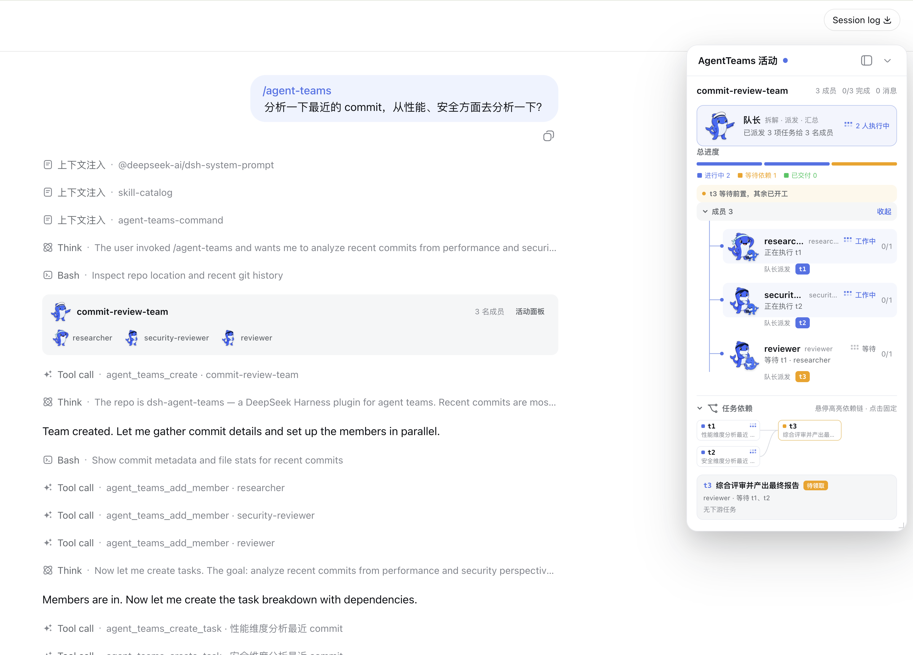

<p align="right">
  <strong>English</strong> · <a href="./README_ZH.md">简体中文</a>
</p>

<p align="center">
  
</p>

<p align="center">
  <a href="https://www.npmjs.com/package/@nanmicoder/dsh-agent-teams"></a>
  <a href="./LICENSE"></a>
  
</p>

## One prompt. A working team.

`dsh-agent-teams` turns the current DeepSeek Harness session into a captain that can assemble durable sub-agents, split a goal into dependency-aware tasks, and coordinate work through direct messages.

Ask in natural language. The plugin provides the team protocol, ten coordination tools, persistent state, an automatic shared-task scheduler, and a live Web UI—without requiring a separate workflow engine.

<p align="center">
  
</p>

## Releases

Read the [latest release notes](https://github.com/NanmiCoder/dsh-agent-teams/releases/latest) or browse the [complete release history](https://github.com/NanmiCoder/dsh-agent-teams/releases). The same Markdown notes are included in the npm package under `release-notes/`.

## Why AgentTeams?

| Capability | What it changes |
| --- | --- |
| **Captain-led delegation** | The current session creates the team, assigns roles, and consolidates the final result. |
| **Durable members** | Members are continuable DSH sub-agents that can be woken for focused follow-up turns. |
| **Dependency-aware tasks** | Tasks move through explicit states and cannot be claimed before their dependencies finish. |
| **Automatic reuse and safe takeover** | Idle members claim the next ready task; reassignment revokes stale attempts before new work starts, and cold recovery retries stranded open attempts. |
| **Direct messaging** | Members send durable mailbox messages directly to teammates or the captain—no relay required. |
| **Live activity panel** | The Web UI combines segmented progress, a collapsible roster, and an interactive task DAG; completed archives retain their full member and task history. |

The conversation card and activity panel use Harness's official locale service. They follow live language changes between English and Simplified Chinese—including status labels, dynamic summaries, controls, archive markers, and accessibility text—without a page reload or a separate plugin setting.

## Install

> [!NOTE]
> Requires an existing [DeepSeek Harness](https://github.com/deepseek-ai/deepseek-harness) installation.

### npm

```sh
dsh plugin --profile web add @nanmicoder/dsh-agent-teams@latest
```

### Build from source

```sh
git clone https://github.com/NanmiCoder/dsh-agent-teams.git
cd dsh-agent-teams
pnpm install
pnpm build
dsh plugin --profile web add .
```

Run `pnpm build` again after changing the source. The local plugin install remains linked to this checkout.

Validate the composed profile, restart DSH, and refresh the Web UI:

```sh
dsh --profile web --dump-config
dsh web
```

Then ask for a team directly:

> Use AgentTeams to review the commits after v0.5.3 from performance, security, and product perspectives. Return one consolidated report.

## How it works

1. The current session creates a team and becomes its captain.
2. The captain adds role-specific members backed by continuable sub-agents.
3. The goal becomes tasks with owners and explicit dependencies.
4. The shared scheduler uses real `running / idle / ready` state to atomically claim one ready task per idle member and wake it. An interrupted resident attempt stays parked and can resume through a direct message without losing its capability; after a cold process restart, the scheduler retries stranded open work with a fresh attempt.
5. Members update with the current `attempt_id`; reassignment or captain takeover revokes the old attempt and waits for the old worker to quiesce before a new attempt starts.
6. The captain presents the combined result, then archives the complete team record.

Team state is stored under `<workspace>/.agent-teams/`; the Web panel reads that disk truth and combines it with live sub-agent activity.

Member creation is zero-interaction by default: a member on the captain's current LLM route snapshots that provider, model, and reasoning effort, while a member on a requested alternative route snapshots the target model's default effort; later continuations restore the resolved snapshot. Only an explicit heterogeneous-team request (for example, “backend on provider A/model X, frontend on provider B/model Y”) supplies a member-specific `provider` + `model`; there is no per-member model or reasoning prompt.

## Slash command

No “use AgentTeams” phrasing required. The plugin registers the
closed-namespace `/agent-teams` host command, so the Web GUI slash menu shows
an `agent-teams` placeholder with an input hint: pick it (or type the
command), describe the goal, and press Enter.

```
/agent-teams research the pricing pages of three competitors
```

The command pipeline claims the line, then preserves that exact input as an
ordinary user follow-up so it remains visible in the main chat. The gesture
boundary adds the deterministic activation directive at pre-step, so the
captain protocol still starts immediately. The invocation is also durably
logged (`command/run` / `command/done`).

Surfaces without command adjudication (for example the headless CLI) get the
same deterministic activation through a gesture boundary: any genuine user
message starting with `/agent-teams` activates the protocol for the rest of
the text. Mid-sentence mentions stay ordinary prose.

## Configuration

Defaults work without extra setup. A trusted profile can override member behavior:

```yaml
- id: agent-teams
  config:
    stateDir: .agent-teams
    memberProvider: spawn
    memberModel: deepseek-v4
    memberMaxDepth: 1
    maxMembers: 8
```

`memberProvider` is the sub-agent runtime backend (`spawn` / `fork`), not an LLM provider. Cross-LLM-provider routing uses the optional `provider` + `model` fields of `agent_teams_add_member`; `memberModel` is only a model default for all members. A member on the captain's current provider/model inherits the captain's reasoning effort, while a changed provider or model automatically uses the target model's default. To request a particular effort, pass the optional `reasoning_effort` field — one of the target model's supported effort ids, or `"default"` to force the model's own default.

`slashCommand: false` disables the deterministic `/agent-teams` activation surfaces (slash command and gesture boundary), leaving the natural-language trigger as the only entry point.

## Boundaries

- One captain leads one active team at a time.
- Idle members with no open task are automatically reused for ready work. An idle member that still owns an open attempt is parked until messaged or explicitly reassigned; messages that cannot be delivered live remain durable and are retried at a later status boundary.
- State is file-backed and serialized within one DSH process; concurrent processes editing the same team are not coordinated.
- The activity panel reports persisted state as-is. Models may occasionally finish work without performing the expected task-state update.

See [docs/usage.md](./docs/usage.md) for the full tool reference, state model, Web UI behavior, configuration, and known limits.

## Plugin development Skill

The repository also ships the open Agent Skills package [`dsh-plugin-development`](./skills/dsh-plugin-development/SKILL.md):

```sh
npx skills add NanmiCoder/dsh-agent-teams --skill dsh-plugin-development
```

## Documentation

| Guide | Covers |
| --- | --- |
| [Usage](./docs/usage.md) | Architecture, UI behavior, tools, configuration, limits, and validation |
| [Verification](./docs/verification-guide.md) | Offline, composition, real e2e, and GUI verification |
| [Plugin development](./docs/developing-dsh-plugins.md) | Human-readable guide built from this plugin |
| [README writing](./docs/readme-writing-guide.md) | Repository documentation conventions |

## Development

```sh
pnpm install
pnpm build
pnpm verify
```

## License

[MIT](./LICENSE)
