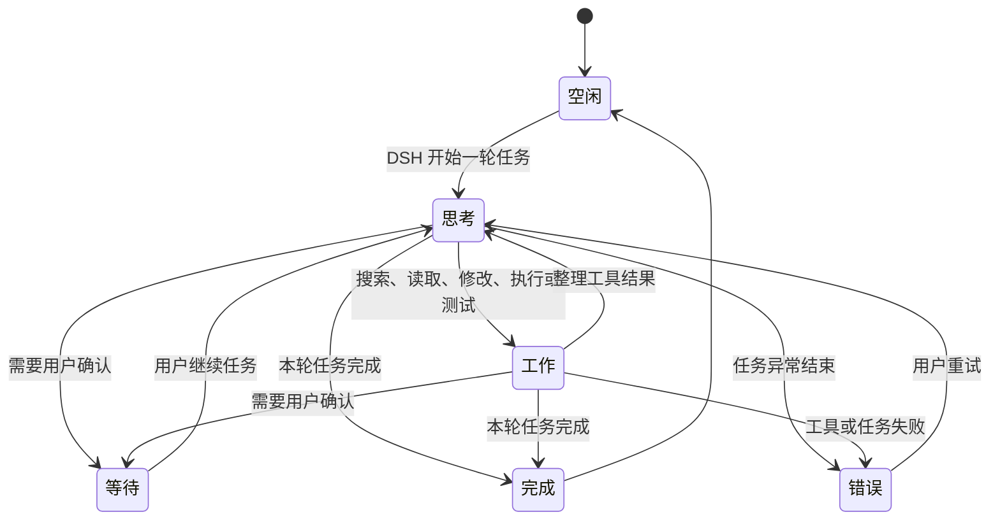

<div align="center">

# DSH 大肥鱼 🐋

**住在 Windows 桌面上、由 DeepSeek Harness 真实工作状态驱动的 Agent 伴侣。**

入口属于 DSH，生命周期属于 DSH，显示层属于桌面。

[English](README_EN.md) · [npm](https://www.npmjs.com/package/dsh-dafeiyu) · [下载最新版本](https://github.com/QCYTSN/dsh-dafeiyu/releases/latest) · [更新与回退](docs/UPDATING.md) · [验收记录](docs/ACCEPTANCE.md)

</div>


DSH 大肥鱼不是一个需要单独启动的桌宠应用。它由 DSH 插件启用，跟随 DSH
一起启动和退出，并以透明、无边框、始终置顶的原生窗口显示在桌面上。即使切换到
VS Code、浏览器或文件管理器，也能知道 DSH 当前在思考、修改、测试、等待还是已经完成。

> 当前版本：`0.1.0-alpha.6` · Windows MVP Alpha

## 它有什么用？

- **离开 DSH 页面也能看到状态**：大肥鱼始终显示在 Windows 桌面最上层。
- **反馈来自真实 Agent 事件**：不会读取屏幕，也不会把你在其他软件里的操作误判为 DSH 工作。
- **展示足够但不过量的信息**：项目名、当前阶段、正在进行的步骤和真实待办进度会显示在状态卡上。
- **有生命力但不打扰**：思考、查找、修改、执行、验证、等待、完成和错误都有对应动作与自然文案。
- **没有第二套应用入口**：无需单独运行 Helper、安装 Python或配置额外端口。

如果 DSH 没有提供待办清单，大肥鱼只显示“分析阶段”“实现阶段”“验证阶段”等可靠信息，
不会编造完成百分比。

## 状态展示

| 思考 | 工作 |
| --- | --- |
|  |  |

| 等待确认 | 完成 |
| --- | --- |
|  |  |

| 遇到问题 |
| --- |
|  |

状态大致按照下面的流程变化：



多个 DSH Session 同时运行时，默认优先展示最需要注意的顶层任务：

`等待确认 > 错误 > 工作 > 思考 > 空闲`

## 系统要求

- Windows 10/11 x64
- 已安装并能正常运行的 DeepSeek Harness WebUI
- DSH CLI 中可以使用 `plugin --profile web` 命令
- npm 上的 `dsh-dafeiyu@alpha`，或 GitHub Release 中的 `.tgz` 安装包

普通用户**不需要**安装 Python、PySide6 或单独运行
`dsh-dafeiyu-helper.exe`。Windows Helper 已经包含在发布包里。

当前 Alpha 版的设置与桌面状态文案使用简体中文。

## 安装插件

### 1. 完全退出 DSH

先关闭 DSH Host，而不只是关闭浏览器标签页。安装或更新时不要让旧版插件继续运行。

### 2. 一行命令安装

在 PowerShell 中进入你的 DSH 安装目录，例如：

```powershell
cd D:\DSH
```

然后从 npm 安装当前 Alpha：

```powershell
pnpm exec dsh plugin --profile web add dsh-dafeiyu@alpha
```

如果你的系统已经能直接使用全局 `dsh` 命令，只需要：

```powershell
dsh plugin --profile web add dsh-dafeiyu@alpha
```

### 3. GitHub Release 备用安装方式

进入 [GitHub Releases](https://github.com/QCYTSN/dsh-dafeiyu/releases/latest)，下载最新的：

```text
dsh-dafeiyu-<version>.tgz
```

不要解压这个文件。

不解压，在 DSH 目录中直接安装下载的插件包：

```powershell
pnpm exec dsh plugin --profile web add "C:\Users\you\Downloads\dsh-dafeiyu-<version>.tgz"
```

### 4. 启动 DSH

照常启动 DSH WebUI。插件默认启用，大肥鱼会由 DSH 自动拉起；不要手动打开 Helper。

### 5. 找到设置入口

在 DSH WebUI 中进入：

```text
设置 → 插件 → 插件配置 → 大肥鱼桌面伴侣
```


## 怎么使用？

安装后不需要额外操作：

1. 启动 DSH。
2. 在 DSH 中开始一个项目任务。
3. 大肥鱼根据 DSH 的真实事件切换动作和状态卡。
4. 切换到其他窗口继续工作；大肥鱼仍然保持在桌面最上层。
5. DSH Host 真正退出后，大肥鱼自动退出。

状态卡可能显示：

- 项目目录名称，例如 `dsh-dafeiyu`
- 当前阶段，例如“分析阶段”“实现阶段”“验证阶段”
- 当前待办，例如“完善项目文档”
- 真实进度，例如“已完成 3/5 步”
- 等待、完成或错误提示

大肥鱼不会监听 VS Code、浏览器或其他应用，也不会截图。只有 DSH Agent 的事件能够
改变它的工作状态。

## 可配置项目

| 设置 | 作用 |
| --- | --- |
| 启用大肥鱼 | 立即显示或关闭桌面伴侣 |
| 角色大小 | 在 70%～140% 之间调整 |
| 活跃程度 | 控制空闲时眨眼、观察等微动作频率 |
| 减少动态效果 | 减少走动、循环帧和程序化晃动 |
| 响应子 Agent | 允许子 Agent 状态参与优先级选择；默认关闭 |

设置由 DSH 保存，更新插件后通常不需要重新配置。

## 桌面互动

- **拖动**：按住大肥鱼移动位置，位置会自动保存。
- **点击或双击**：触发摸头、戳一下、尾巴等短互动，之后恢复最新 DSH 状态。
- **右键菜单**：调整大小、减少动态、本次隐藏或本次关闭。
- **本次隐藏**：只隐藏窗口，不禁用插件。
- **本次关闭**：关闭当前 Helper，本次 DSH 运行期间不会自动重启；下次启动 DSH 会再次出现。

## 更新插件

GitHub 仓库出现新提交后，已经安装的插件**不会自动变化**。新版本发布后，完全退出
DSH，然后更新 npm Alpha 包：

```powershell
cd D:\DSH
pnpm exec dsh plugin --profile web update dsh-dafeiyu@alpha
```

也可以再次执行安装命令，它会解析 `alpha` 标签指向的新版本：

```powershell
pnpm exec dsh plugin --profile web add dsh-dafeiyu@alpha
```

使用 GitHub Release 安装的用户，可以下载新 `.tgz` 后覆盖安装：

```powershell
pnpm exec dsh plugin --profile web add "C:\Users\you\Downloads\dsh-dafeiyu-<new-version>.tgz"
```

以上方式都会替换插件及随包携带的 Windows Helper，并保留 DSH 已保存的设置。详细
说明见 [插件更新与回退](docs/UPDATING.md)。

## 回退到旧版本

完全退出 DSH，重新安装之前保留的旧版 `.tgz`：

```powershell
cd D:\DSH
pnpm exec dsh plugin --profile web add "C:\Users\you\Downloads\dsh-dafeiyu-<old-version>.tgz"
```

## 卸载插件

完全退出 DSH 后运行：

```powershell
cd D:\DSH
pnpm exec dsh plugin --profile web remove dsh-dafeiyu
```

然后重新启动 DSH。插件代码和 Helper 会从 `web` profile 中移除。DSH 可能保留一份
不会再生效的历史设置，这不会启动进程或占用额外端口。

## 常见问题

<details>
<summary><strong>安装后没有看到大肥鱼</strong></summary>

1. 确认安装使用的是 `--profile web`。
2. 完全退出并重新启动 DSH Host。
3. 进入“设置 → 插件 → 插件配置”确认“启用大肥鱼”已经勾选。
4. 确认使用 Windows x64 发布包，而不是只克隆了缺少预构建 Helper 的源码。

</details>

<details>
<summary><strong>关闭了 DSH 网页，为什么大肥鱼还在？</strong></summary>

大肥鱼绑定的是 DSH Host 生命周期，而不是浏览器标签页。只要 DSH 后台仍在运行，
大肥鱼就会继续显示；真正退出 DSH Host 后它会自动关闭。

</details>

<details>
<summary><strong>为什么没有显示数字进度？</strong></summary>

只有 DSH 写入了结构化待办时，插件才能可靠计算“已完成 3/5 步”。没有真实待办数据时，
状态卡只显示当前工作阶段，避免制造虚假的百分比。

</details>

<details>
<summary><strong>右键选择“本次关闭”后为什么没有自动回来？</strong></summary>

这是预期行为。“本次关闭”会抑制当前 DSH 运行期间的自动重启；完全退出并重新启动
DSH 后会恢复。若想永久关闭，请在 DSH 设置中取消“启用大肥鱼”。

</details>

## 隐私与边界

- 不读取或保存模型 API Key
- 不截图，不读取其他窗口内容
- 不发送遥测
- 不监听键盘输入或其他应用行为
- 不新开网络端口；设置卡复用 DSH 的本地 Web 服务
- 默认只跟随最近活跃的顶层 DSH Session

## 开发与测试

```powershell
pnpm install
npm test
py -3 -m unittest discover -s runtime/tests -t .
```

开发时可以从源码运行 Helper，但正式用户不应手动启动它：

```powershell
py -3 -m pip install -r requirements.txt
py -3 runtime\helper.py
```

构建 Windows Helper：

```powershell
python -m pip install -r requirements.txt pyinstaller
$env:DSH_DAFEIYU_BUILD_PYTHON = (Get-Command python).Source
npm run build:helper:windows
```

## 更多文档

- [产品范围与取舍](docs/PRODUCT_SCOPE.md)
- [执行计划](docs/EXECUTION_PLAN.md)
- [兼容性验证](docs/PHASE0.md)
- [Windows 验收与性能记录](docs/ACCEPTANCE.md)
- [更新、回退与卸载](docs/UPDATING.md)
- [角色视觉资产许可](ASSET_LICENSE.md)

相关项目：[QCYTSN/ds-local-pet](https://github.com/QCYTSN/ds-local-pet) 是独立桌宠版本；
本仓库是只服务于 DSH 状态的插件版本。

## License

代码采用 [MIT License](LICENSE)。角色视觉资产不适用 MIT 代码许可证，来源和使用边界
见 [ASSET_LICENSE.md](ASSET_LICENSE.md)。
